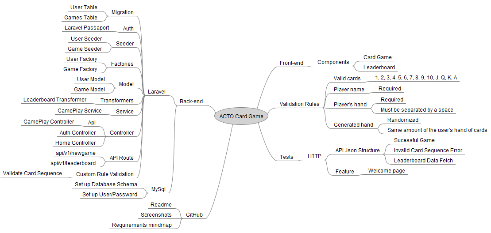

# ACTO Take Home Assignment

A simple card game.

## Technology Stack

- [x] [Laravel 7](https://laravel.com)
- [x] [Laradock](https://laradock.io)
- [x] [Fractal](https://fractal.thephpleague.com)
- [x] [Passport](https://github.com/laravel/passport)
- [x] [MySql](https://mysql.com)
- [x] [VueJs](https://vuejs.org/)
- [x] [Axios](https://github.com/axios/axios)
- [x] [Bootstrap 4](http://getbootstrap.com/)

## Tools

- [x] [PHPStorm](https://www.jetbrains.com/phpstorm/)
- [x] [Navicat](https://navicat.com)
- [x] [FreeMind](http://freemind.sourceforge.net/wiki/index.php/Main_Page)

## Requirements

Your task is to create a Laravel application using an API & relational database for the backend and Vue.js for the frontend.

#### The application should have one page which includes

* an input field which allows users to enter their name (required)
* an input field which allows users to enter a hand of cards, each card should be separated by a space. For example: 1 4 6 J K A
* valid cards include: 1, 2, 3, 4, 5, 6, 7, 8, 9, 10, J, Q, K, A
* a ‘Play’ button, when this is clicked a random hand of cards with the same amount of cards that the user entered should be generated and displayed to the user.
* The user’s hand of cards should then be compared to the generated hand of cards. Each card in the player’s hand should be compared to the card in the same position in the generated hand. Highest value card wins. For example:
  * Player’s hand: 5 7 A K
  * Generated Hand: 4 8 K Q
* A score should be calculated for the player and generated hand, in this example it would be:
  * Player: 3
  * Generated: 1
* The results of the game should then be shown to the user
* The results should also be stored in the database, each row should represent one play this should include:
  * the user’s name,
  * the user’s score
  * the generated hand score
  * a boolean indicating whether the user won
  * timestamps
* A leaderboard should be shown at the bottom of page with each user’s name and the total number of games and hands that they have won.
* Validation should be included on the API to ensure that a name is provided and all of the cards are valid. Any validation messages should be displayed to the user
* Additional info:
  * user authentication is not required
  * UI and styling is not required, basic bootstrap would be great
  * The main focus of this assignment is on code quality, minor details are not important.
* Submission:
  * Create a public repo on your Github account and send us the link
  * Screenshots would be great as well.

## Mindmap

## Database tables

## Screenshots

#### Welcome page

#### Login / Register page

#### Game component

#### Result score

#### Invalid Card Sequence

#### Leaderboard component

